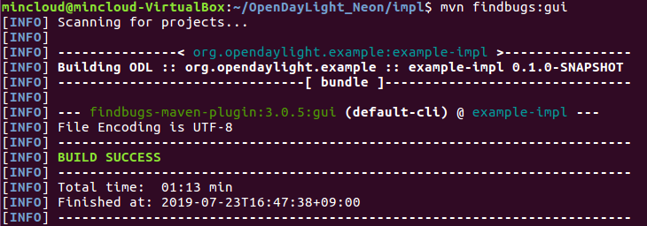

# OpenDayLight_Neon Project
ODL Neon SR1 Example Project

## Pre requisites
* Apache Maven 3.6.1
* Java version: 1.8.0_212
* OpenDayLight Neon SR1 Installing
* Default OpenDayLight [settings.xml]
```
$ cp -n ~/.m2/settings.xml{,.orig} ; wget -q -O - https://raw.githubusercontent.com/opendaylight/odlparent/master/settings.xml > ~/.m2/settings.xml
```
___

## Building an Example Module
To develop an app perform the following steps.

1. Create an Example project using Maven and an archetype called the opendaylight-startup-archetype. If you are downloading this project for the first time, then it will take sometime to pull all the code from the remote repository.
```
$~/opendaylight-0.10.1$ mvn archetype:generate -DarchetypeGroupId=org.opendaylight.archetypes -DarchetypeArtifactId=opendaylight-startup-archetype 
-DarchetypeCatalog=remote -DarchetypeVersion=1.1.2-SNAPSHOT
```


2. Build the Project
```
$ mvn clean install -DskipTests -Dcheckstyle.skip
```


3. Run Karaf
```
$ cd /karaf/target/assembly/bin
$ ./karaf
```

___

## Defining a RPC
1. Now view the entry point to understand where the log line came from. The entry point is in the impl project:
```
$ impl/src/main/java/org/opendaylight/example/impl/ExampleProvider.java
```
2. Add any new things that you are doing in your implementation by using the [ExampleProvider.onSessionInitiate] method.
```js
	@Override
    public void onSessionInitiated(ProviderContext session) {
        LOG.info("ExampleProvider Session Initiated");
    }
```
___

## Add a RPC API
```
$ cd api/src/main/yang/example.yang
```
1. Edit this file as follows. In the following example, we are adding the code in a YANG module to define the exampl RPC:
```js
	module example {
	    yang-version 1;
	    namespace "urn:opendaylight:params:xml:ns:yang:example";
	    prefix "example";

	    revision "2018-05-17" {
	        description "Initial revision of example model";
	    }

	    rpc example-test {
	        input {
	            leaf name {
	                type string;
	            }
	        }
	        output {
	            leaf greeting {
	                type string;
	            }
	        }
	    }
}
````

2. Return to the example/api directory and build your API as follows.
```
$ cd api
$ mvn clean install -DskipTests -Dcheckstyle.skip
```

___

## Implement a RPC API
1. Define the ExampleService, which is invoked through the Example API.
```
$ cd ../impl/src/main/java/org/opendaylight/example/impl/
```
2. Create a new file called [ExampleTestImpl.java] and add in the code below.
```js
	package org.opendaylight.example.impl;

	import java.util.concurrent.Future;
	import org.opendaylight.yang.gen.v1.urn.opendaylight.params.xml.ns.yang.example.rev180517.ExampleService;
	import org.opendaylight.yang.gen.v1.urn.opendaylight.params.xml.ns.yang.example.rev180517.ExampleTestInput;
	import org.opendaylight.yang.gen.v1.urn.opendaylight.params.xml.ns.yang.example.rev180517.ExampleTestOutput;
	import org.opendaylight.yang.gen.v1.urn.opendaylight.params.xml.ns.yang.example.rev180517.ExampleTestInputBuilder;
	import org.opendaylight.yang.gen.v1.urn.opendaylight.params.xml.ns.yang.example.rev180517.ExampleTestOutputBuilder;
	import org.opendaylight.yangtools.yang.common.RpcResult;
	import org.opendaylight.yangtools.yang.common.RpcResultBuilder;

	public class ExampleTestImpl implements ExampleService {

	    @Override
	    public Future<RpcResult<ExampleTestOutput>> exampleTest(ExampleTestInput input) {
	        ExampleTestOutputBuilder exampleBuilder = new ExampleTestOutputBuilder();
	        exampleBuilder.setGreeting("This is ExampleTest Message " + input.getName());
	        return RpcResultBuilder.success(exampleBuilder.build()).buildFuture();
	    }
	}
```
3. The ExampleProvider.java file is in the current directory. Register the RPC that you created in the [example.yang] file in the [ExampleProvider.java] file.
```js
	package org.opendaylight.example.impl;

	import org.opendaylight.controller.md.sal.binding.api.DataBroker;
	import org.opendaylight.controller.sal.binding.api.BindingAwareBroker.ProviderContext;
	import org.opendaylight.controller.sal.binding.api.BindingAwareBroker.RpcRegistration;
	import org.opendaylight.controller.sal.binding.api.BindingAwareProvider;
	import org.opendaylight.yang.gen.v1.urn.opendaylight.params.xml.ns.yang.example.rev180517.ExampleService;
	import org.slf4j.Logger;
	import org.slf4j.LoggerFactory;

	public class ExampleProvider implements BindingAwareProvider, AutoCloseable {

	    private static final Logger LOG = LoggerFactory.getLogger(ExampleProvider.class);
	    private RpcRegistration<ExampleService> exampleService;

	    @Override
	    public void onSessionInitiated(ProviderContext session) {
	        LOG.info("ExampleProvider Session Initiated");
	        exampleService = session.addRpcImplementation(ExampleService.class, new ExampleTestImpl());
	    }

	    @Override
	    public void close() throws Exception {
	        LOG.info("ExampleProvider Closed");
	        if (exampleService != null) {
	            exampleService.close();
	        }
	    }
	}
```
4. Optionally, you can also build the Java classes which will register the new RPC. This is useful to test the edits you have made to ExampleProvider.java and ExampleTestImpl.java.
```
$ cd impl
$ mvn findbugs:gui
```


5. Build the entire example again, which will pickup the changes you have made and build them into your project:
```
$ mvn clean install -DskipTests -Dcheckstyle.skip
```

* Tree Architecture

___

## Test the example-test RPC via REST
```
1. 
```
## Bugs

Please report bugs to mincloud@sk.com

## Contributing

The github repository is at https://github.com/mincloud1501/OpenDayLight_Neon.git

## See Also

Some other stuff.

## Author

J.Ho Moon, <mincloud@sk.com>

## Copyright and License

(c) Copyright 1997~2019 by SK Broadband Co.LTD