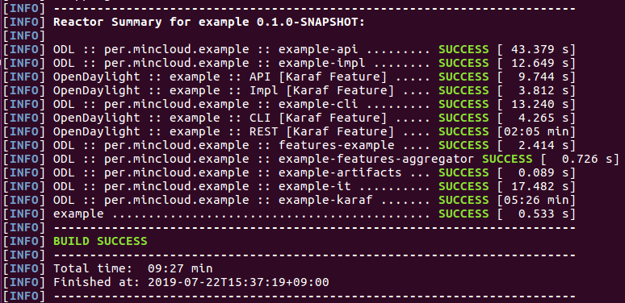

# OpenDayLight_Neon Project
ODL Neon Example Project

## Pre requisites
* Maven 3.5.2 or later
* Java 8-compliant JDK
* default OpenDaylight settings.xml file
```
cp -n ~/.m2/settings.xml{,.orig} ; wget -q -O - https://raw.githubusercontent.com/opendaylight/odlparent/master/settings.xml > ~/.m2/settings.xml
```

## Building an example module
To develop an app perform the following steps.

1. Create an Example project using Maven and an archetype called the opendaylight-startup-archetype. If you are downloading this project for the first time, then it will take sometime to pull all the code from the remote repository.
```
mvn archetype:generate -DarchetypeGroupId=org.opendaylight.archetypes -DarchetypeArtifactId=opendaylight-startup-archetype \
-DarchetypeCatalog=remote -DarchetypeVersion=1.1.2-SNAPSHOT
```


2. Build the Project
```
mvn clean install -DskipTests -Dcheckstyle.skip=true
```



## Bugs

Please report bugs to mincloud1501@naver.com

## Contributing

The github repository is at https://github.com/mincloud1501/OpenDayLight_Neon.git

## See Also

Some other stuff.

## Author

J.Ho Moon, <mincloud1501@naver.com>

## Copyright and License

(c) Copyright 1997~2019 by SKB Co. LTD
